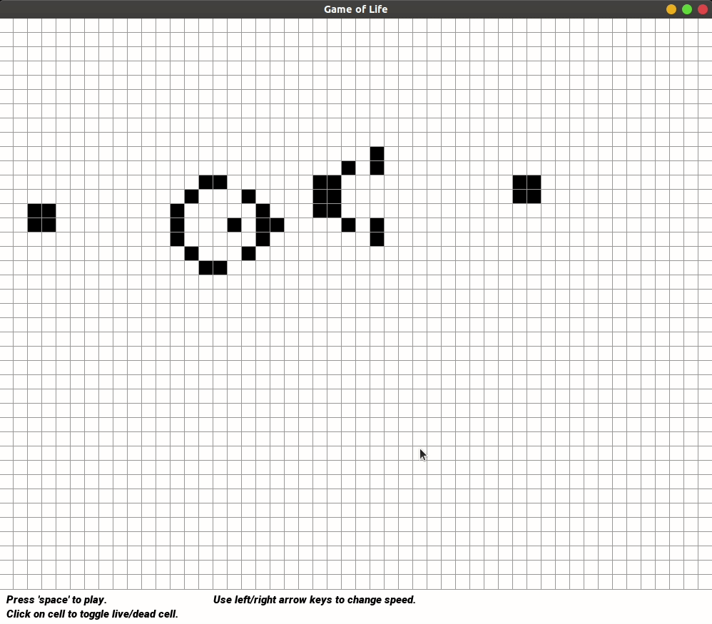
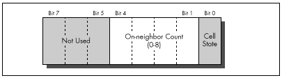

# Life



## Conway's Game of Life
This is an optimized version of [Conway's Game of Life](https://en.wikipedia.org/wiki/Conway%27s_Game_of_Life)

Using an inspired approach from [The Graphics Programming Black Book](http://www.jagregory.com/abrash-black-book/#chapter-17-the-game-of-life), we can store the cell state and neighbor count in one char byte.



This along with other minor optimizations gives us an almost 30x compute improvement.

## Dependencies
CMake was used to create create build files, you can install it using the instructions on their website
https://cmake.org/download/

This application also uses SFML, you can also install it using the instructions on their websites:
https://www.sfml-dev.org/tutorials/2.5/#getting-started

On linux it's as easy:

```sudo apt-get install libsfml-dev```

## Build Steps
```
git clone https://github.com/ash-xyz/life # Clone repository
cd Life
mkdir build # Create build folder
cd build
cmake .. # Create cmake build files
cmake --build . # Automatically runs build tools, can also be opened in IDE
```
And finally, run ```./Life``` in the build folder.

## TODO
* Finish writing Tests
* Write Catch2 Benchmarks